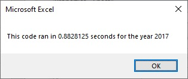
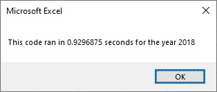
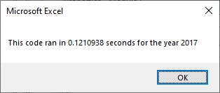
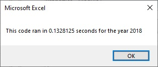

# Stock-analysis

## Overview of Project

### Purpose of Analysis
To read through a list of stock quotes and return a table showing the total Value as well as Return on investment percentage for the following stock tickers: "AY", "CSIQ", "DQ", "ENPH", "FSLR", "HASI", "JKS", "RUN", "SEDG", "SPWR", "TERP", "VSLR". Although the current code works well for a dozen stocks, it might not work as well for substantially larger lists stocks; it may take a long time to execute.

To expand upon the original requested script we have refactored the current code to increase processing speed by utilizing arrays and reducing our loop through the stocks lists to once.

## Results

### Conclusions for Refactoring Code
After refactoring the code for the stock analysis, it still produces the output as expected but with the benefit of an increase in processing speed.

 

The following images show the processing speed of the original script while running analysis for 2017 (left) and 2018 (right) followed by the processing speed after refactoring.

#### Before
 

#### After
 

## Summary
### Possible Advantages and Disadvantages of Refactoring Code

|Advantages|Disadvantages|
| --- | --- |
|Removed redundancies and duplications improve the effectiveness of the code|Imprecise refactoring could introduce new bugs and errors into the code |
|Improved legibility improves the comprehensibility of the code for other programmers|There is no clear definition of “neat code” |
|Restructuring the code is possible without altering the functionality|The benefit is not self-evident; Improved code is often difficult for user to recognize when the functionality stays the same|

Click [here](https://www.ionos.com/digitalguide/websites/web-development/what-is-refactoring/) to see the article that the above advantages and disadvantages of refactoring were borrowed from. The article is related to web-development but the list can be applied here as well.

### Pros and Cons of Our Refactoring
The refactoring that we performed on the original code leans more toward the advantageous by removing the redundancy of looping through the full stock list while keeping the functionality consistent.  The only disadvantage after updating would be that if we removed the timing message the increase in speed would most likely not be noticed by the user.

